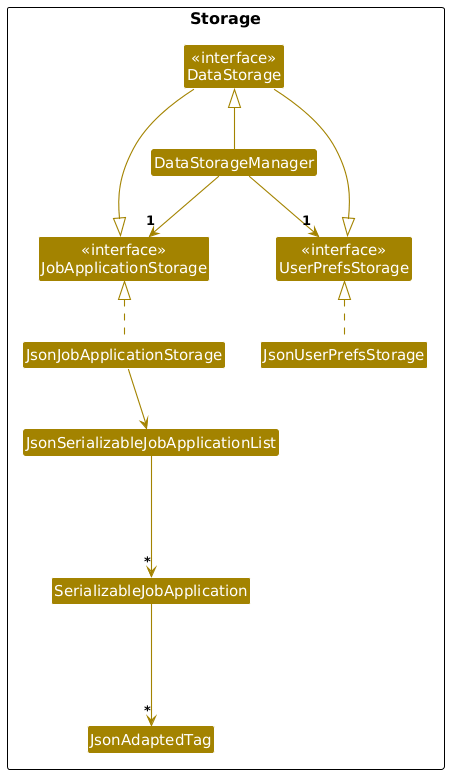
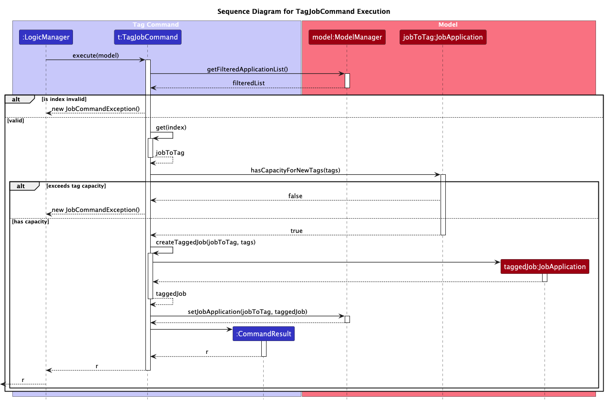
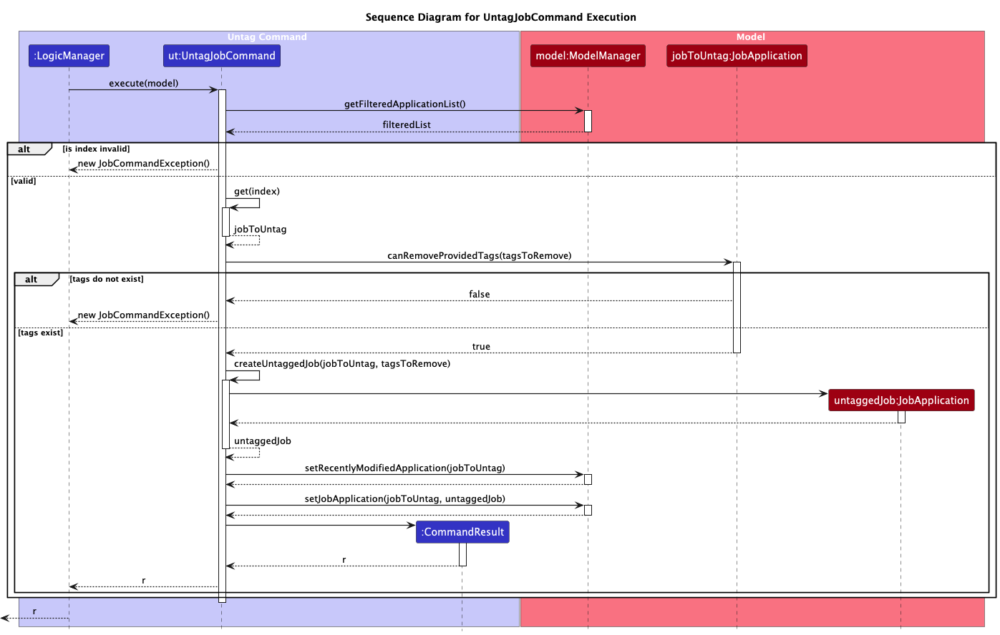

* Table of Contents
{:toc}

--------------------------------------------------------------------------------------------------------------------

## **Acknowledgements**

* This project is based on the AddressBook-Level3 project created by the [SE-EDU initiative](https://se-education.org).
* Libraries used: [JavaFX](https://openjfx.io/), [Jackson](https://github.com/FasterXML/jackson), [JUnit5](https://github.com/junit-team/junit5)

--------------------------------------------------------------------------------------------------------------------

## **Setting up, getting started**

Refer to the guide [_Setting up and getting started_](SettingUp.md).

--------------------------------------------------------------------------------------------------------------------

## **Design**

<div markdown="span" class="alert alert-primary">

:bulb: **Tip:** The `.puml` files used to create diagrams are in this document `docs/diagrams` folder. Refer to the [_PlantUML Tutorial at se-edu/guides_](https://se-education.org/guides/tutorials/plantUml.html) to learn how to create and edit diagrams.
</div>

### Architecture


The ***Architecture Diagram*** given above explains the high-level design of the App.

Given below is a quick overview of main components and how they interact with each other.

**Main components of the architecture**

**`Main`** (consisting of classes [`Main`](https://github.com/AY2526S1-CS2103T-T11-1/tp/tree/master/src/main/java/seedu/job/Main.java) and [`MainApp`](https://github.com/AY2526S1-CS2103T-T11-1/tp/tree/master/src/main/java/seedu/job/MainApp.java)) is in charge of the app launch and shut down.
* At app launch, it initializes the other components in the correct sequence, and connects them up with each other.
* At shut down, it shuts down the other components and invokes cleanup methods where necessary.

The bulk of the app's work is done by the following four components:

* [**`UI`**](#ui-component): The UI of the App.
* [**`Logic`**](#logic-component): The command executor.
* [**`Model`**](#model-component): Holds the data of the App in memory.
* [**`Storage`**](#storage-component): Reads data from, and writes data to, the hard disk.

[**`Commons`**](#common-classes) represents a collection of classes used by multiple other components.

**How the architecture components interact with each other**

The *Sequence Diagram* below shows how the components interact with each other for the scenario where the user issues the command `delete 1`.


Each of the four main components (also shown in the diagram above),

* defines its *API* in an `interface` with the same name as the Component.
* implements its functionality using a concrete `{Component Name}Manager` class (which follows the corresponding API `interface` mentioned in the previous point.

For example, the `Logic` component defines its API in the `Logic.java` interface and implements its functionality using the `LogicManager.java` class which follows the `Logic` interface. Other components interact with a given component through its interface rather than the concrete class (reason: to prevent outside component's being coupled to the implementation of a component), as illustrated in the (partial) class diagram below.


The sections below give more details of each component.

### UI component

The **API** of this component is specified in [`Ui.java`](https://github.com/AY2526S1-CS2103T-T11-1/tp/tree/master/src/main/java/seedu/job/ui/Ui.java)


The UI consists of a `MainWindow` that is made up of parts e.g.`CommandBox`, `ResultDisplay`, `JobApplicationListPanel`, `StatusBarFooter` etc. All these, including the `MainWindow`, inherit from the abstract `UiPart` class which captures the commonalities between classes that represent parts of the visible GUI.

The `UI` component uses the JavaFx UI framework. The layout of these UI parts are defined in matching `.fxml` files that are in the `src/main/resources/view` folder. For example, the layout of the [`MainWindow`](https://github.com/AY2526S1-CS2103T-T11-1/tp/tree/master/src/main/java/seedu/job/ui/MainWindow.java) is specified in [`MainWindow.fxml`](https://github.com/AY2526S1-CS2103T-T11-1/tp/tree/master/src/main/resources/view/MainWindow.fxml)

The `UI` component,

* executes user commands using the `Logic` component.
* listens for changes to `Model` data so that the UI can be updated with the modified data.
* keeps a reference to the `Logic` component, because the `UI` relies on the `Logic` to execute commands.
* depends on some classes in the `Model` component, as it displays `JobApplication` objects residing in the `Model`.

### Logic component

**API** : [`Logic.java`](https://github.com/AY2526S1-CS2103T-T11-1/tp/tree/master/src/main/java/seedu/job/logic/Logic.java)

Here's a (partial) class diagram of the `Logic` component:


The sequence diagram below illustrates the interactions within the `Logic` component, taking `execute("delete 1")` API call as an example.


<div markdown="span" class="alert alert-info">:information_source: **Note:** The lifeline for `DeleteCommandParser` should end at the destroy marker (X) but due to a limitation of PlantUML, the lifeline continues till the end of diagram.
</div>

How the `Logic` component works:

1. When `Logic` is called upon to execute a command, it is passed to a `JobBookCommandParser` object which in turn creates a parser that matches the command (e.g., `DeleteCommandParser`) and uses it to parse the command.
1. This results in a `Command` object (more precisely, an object of one of its subclasses e.g., `DeleteJobCommand`) which is executed by the `LogicManager`.
1. The command can communicate with the `Model` when it is executed (e.g. to delete a job application).<br>
   Note that although this is shown as a single step in the diagram above (for simplicity), in the code it can take several interactions (between the command object and the `Model`) to achieve.
1. The result of the command execution is encapsulated as a `CommandResult` object which is returned back from `Logic`.

Here are the other classes in `Logic` (omitted from the class diagram above) that are used for parsing a user command:


How the parsing works:
* When called upon to parse a user command, the `JobBookCommandParser` class creates an `XYZCommandParser` (`XYZ` is a placeholder for the specific command name e.g., `AddCommandParser`) which uses the other classes shown above to parse the user command and create a `XYZCommand` object (e.g., `AddJobCommand`) which the `JobBookCommandParser` returns back as a `Command` object.
* All `XYZCommandParser` classes (e.g., `AddCommandParser`, `DeleteCommandParser`, ...) inherit from the `JobParser` interface so that they can be treated similarly where possible e.g, during testing.

### Model component
**API** : [`Model.java`](https://github.com/AY2526S1-CS2103T-T11-1/tp/tree/master/src/main/java/seedu/job/model/jobapplication/Model.java)


The `Model` component,

* stores the job book data i.e., all `JobApplication` objects (which are contained in a `UniqueJobApplicationList` object).
* wraps all job application data in a `JobBook` object which implements the `ReadOnlyJobBook` interface to provide read-only access to external components.
* stores the currently 'selected' `JobApplication` objects (e.g., results of a search query) as a separate _filtered_ list which is exposed to outsiders as an unmodifiable `ObservableList<JobApplication>` that can be 'observed' e.g. the UI can be bound to this list so that the UI automatically updates when the data in the list change.
* stores a `UserPrefs` object that represents the user's preferences. This is exposed to the outside as a `ReadOnlyUserPrefs` objects.
* stores a reference to the recently modified `JobApplication` for UI highlighting purposes.
* does not depend on any of the other three components (as the `Model` represents data entities of the domain, they should make sense on their own without depending on other components)

**Note:** An alternative (arguably, a more OOP) model is given below. It has a `Tag` list in the `JobBook`, which `JobApplication` references. This allows `JobBook` to only require one `Tag` object per unique tag, instead of each `JobApplication` needing their own `Tag` objects.<br>


</div>


### Storage component

**API** : [`DataStorage.java`](https://github.com/AY2526S1-CS2103T-T11-1/tp/blob/master/src/main/java/seedu/job/storage/DataStorage.java)



The `Storage` component manages **persistence (saving and loading)** for job application and user preference data, using the JSON format.


* For easy customisation/replacement, `JobApplicationStorage` and `UserPrefStorage` are left as interfaces to abstract the storage component.
* `DataStorageManager` can be treated as a `JobApplicationStorage` or `UserPrefStorage` object as it implements both interfaces.
* Depends on some classes in the `Model` component such as `JobApplication` as it saves or loads objects from said component.
* `JsonSerializableJobApplicationList & SerializableJobApplication` have a dependency with on JobApplications as both classes possess logic to deserialize/serialize `JobApplication` objects.

---

### Common classes

Classes used by multiple components are in the `seedu.job.commons` package.

--------------------------------------------------------------------------------------------------------------------

## Design Considerations

### Job Application Uniqueness


A job application in HustleHub is uniquely identified by the combination of:
- **Company Name** (case-sensitive)
- **Role** (case-sensitive)
- **Deadline**

**Uniqueness Implementation:**

```java
public final String getUniqueKey() {
    return this.companyName + "|" + this.role;
}

public boolean isSameJobApplication(JobApplication otherJobApplication) {
    return otherJobApplication != null
        && otherJobApplication.getUniqueKey().equals(this.getUniqueKey());
}
```

**Duplicate Handling:**
* Given that companies allows users to have 1 job application per job opening. Minimally these 2 compulsory values are required. Adding additional fields may allow even more duplicate-related issues to arise.

**Alternative Considerations:**

We considered but rejected these alternatives:

| Uniqueness Criteria       | Reason for Rejection                                                                                            |
|---------------------------|-----------------------------------------------------------------------------------------------------------------|
| Company + Role + deadline | Consider that users are restricted to 1 application per job opening.                                            |
| Company + Role + Tags     | Tags are optional and mutable; would force users to add tags to differentiate positions; breaks tag flexibility |
| Company + Role + Status   | Status changes as application progresses; would prevent natural status updates                                  |

### Tag Management

The tag management feature allows users to add and remove tags from job applications. Tags are implemented as immutable `Tag` objects with validation constraints.

**Key Classes:**
* `Tag`: Represents an immutable tag with validation
* `TagJobCommand`: Adds tags to a job application
* `UntagJobCommand`: Removes tags from a job application

**Duplicate Handling:**
* Tags are case-insensitive during computation to disallow tags like `t/Java` and `t/java` from existing at the same time as they are fundamentally the same tag.
* Note that the displayed case is preserved to allow users to see their original input.

**Tag Command Implementation:**

The `TagJobCommand` creates a new `JobApplication` instance with the updated tag set, following the immutable pattern:



1. Retrieves the target application from the filtered list
2. Checks if the index is invalid
3. Validates tag capacity (max 3 tags)
4. Creates new application with `createTaggedJob()` method
5. Calls `model.setJobApplication()` to replace the old application


**Untag Command Implementation:**

Similar to tag command but removes tags:



1. Retrieves the target application
2. Checks if the index is invalid
3. Validates that all tags to remove exist
4. Creates new application with `createUntaggedJob()` method
5. Calls `model.setJobApplication()` to replace the old application


---

### [Proposed] Job Application Expiry

#### Requirements

This feature intends to mark job applications as `STALE` when they have not been edited for 14 days.

- Add a new status value to the existing status enum: `STALE`.
- Add a new field to `JobApplication`: `lastEditedTime` (type: `java.time.LocalDateTime`). This field records the last time the application was modified by any modifying command (add, update, tag, untag).
- On application start-up, HustleHub will perform a one-time calculation over all persisted job applications and set any application whose `lastEditedTime` is 14 full days (>= 14 days) in the past to have status `STALE`.

Notes:
- `STALE` is intended to be an additional, non-terminal status used to surface older, unattended applications. It does not replace `REJECTED` and may coexist with other workflows.

#### Data model changes

1. Status enum (in `JobApplication` or `Status` enum type)
   - Add: `STALE`

2. `JobApplication` fields
   - Add: `private final LocalDateTime lastEditedTime;`
   - Constructor(s) and factory methods must accept and persist `lastEditedTime`.
   - All modifying operations (add, update, tag, untag) must set `lastEditedTime = LocalDateTime.now()` for the newly created `JobApplication` instance.
   - `SerializableJobApplication` (storage layer) must be updated to read/write `lastEditedTime` (ISO-8601 format via `LocalDateTime.toString()` / `LocalDateTime.parse(...)`).

#### Startup calculation (where to run)
- Run the staleness calculation once during application startup after the data is read from disk in `MainApp.initModelManager()`.

#### Persistence
- Update `SerializableJobApplication` / `JsonSerializableJobApplicationList` to include `lastEditedTime` when serializing.

#### Command behavior changes
- Every command that modifies a job application must update `lastEditedTime` to `LocalDateTime.now()` on the newly created `JobApplication` object that replaces the old one. This includes: `AddJobCommand`, `UpdateJobCommand`, `TagJobCommand`, `UntagJobCommand` (and any future modifying commands such as `Clone`, `Archive`, etc.).

#### Edge cases
- Timezones: Use `LocalDateTime` consistently across serialization and comparisons; if your app will run across machines in different timezones, consider `ZonedDateTime` or persist UTC (`Instant`) instead. For single-user desktop app, `LocalDateTime` is acceptable.

--------------------------------------------------------------------------------------------------------------------

## **Documentation, logging, testing, configuration, dev-ops**

* [Documentation guide](Documentation.md)
* [Testing guide](Testing.md)
* [Logging guide](Logging.md)
* [Configuration guide](Configuration.md)
* [DevOps guide](DevOps.md)

--------------------------------------------------------------------------------------------------------------------

## **Appendix: Requirements**

### Product scope

**Target user profile**:

* is a **computing student** actively applying for internships or full-time positions
* needs to **manage multiple job applications** simultaneously across different companies
* values **speed and organization** in tracking application statuses, deadlines, and details
* prefers **desktop applications** over mobile or web-based solutions
* is **comfortable with command-driven interfaces** (CLI) for faster interaction 
* seeks **a streamlined tool** for tracking applications, deadlines, and interview stages
* is **tech-savvy** and appreciates keyboard-optimized workflows like Notion, GitHub, or Google Calendar  

**Value proposition**:  
HustleHub empowers computing students to **efficiently manage their job application process** — providing a fast, keyboard-optimized interface to track applications, deadlines, statuses, and tags all in one place, helping students stay organized during their job search.


### User stories

Priorities: High (must have) - `* * *`, Medium (nice to have) - `* *`, Low (unlikely to have) - `*`

| Priority | As a …​                    | I want to …​                                                                                              | So that I can…​                                              |
|----------|----------------------------|-----------------------------------------------------------------------------------------------------------|--------------------------------------------------------------|
| `* * *`  | student                    | view the list of all my job applications                                                                  | see everything I'm tracking in one place                     |
| `* * *`  | student                    | add job application details (company name, role, application status, deadline)                            | track multiple applications efficiently                      |
| `* * *`  | student                    | delete a job application                                                                                  | remove entries I no longer want to track                     |
| `* * *`  | student                    | view details of a specific job application                                                                | review all the information I've saved about that application |
| `* *`    | student                    | update job application details                                                                            | keep my records current as my applications progress          |
| `* *`    | student                    | sort applications by deadline                                                                             | prioritize applications that need attention first            |
| `* *`    | student                    | sort applications by company name                                                                         | organize my applications alphabetically                      |
| `* *`    | student                    | sort applications by status                                                                               | group applications by their current stage                    |
| `* *`    | student                    | search for job applications by keyword                                                                    | quickly find a specific application                          |
| `* *`    | student                    | filter applications by company name                                                                       | focus on applications from a particular employer             |
| `* *`    | student                    | filter applications by status                                                                             | view only applications at a specific stage                   |
| `* *`    | student                    | add custom tags to job applications                                                                       | categorize them by priority, location, or other criteria     |
| `* *`    | student                    | remove tags from applications                                                                             | update categorization as my needs change                     |
| `* *`    | student                    | see recently modified applications highlighted                                                            | quickly identify which applications I just updated           |
| `* *`    | student                    | set and view application deadlines with date and time                                                     | manage my time effectively and submit applications on time   |
| `* *`    | student                    | track application status (applied, in progress, rejected)                                                 | know the current stage of each application                   |
| `* *`    | student with many applications | clear the application list                                                                             | start fresh when needed                                      |
| `* *`      | new user                   | see usage instructions                                                                                    | learn how to use the app when I forget commands              |
| `* *`      | student                    | have data automatically persisted                                                                         | save my application data after closing the app                 |
| `*`      | student                    | export my job application data                                                                            | back up my data or share it with career counselors           |
| `*`      | student                    | archive old or rejected applications                                                                      | keep my active list clean without losing historical data     |
| `*`      | student                    | add notes to applications                                                                                 | remember specific details about each position or company     |
| `*`      | student                    | track interview rounds completed                                                                          | assess my application progress at a detailed level           |
| `*`      | student                    | store recruiter contact information                                                                       | easily reach out for follow-up questions or updates          |
| `*`      | student                    | track application sources (LinkedIn, company website, referral)                                           | know where my opportunities are coming from                  |
| `*`      | student                    | store links to job postings                                                                               | quickly access the original application details              |
| `*`      | student                    | categorize applications by job type (software engineering, data science)                                  | focus on specific career paths                               |
| `*`      | student                    | see how many days remain until each deadline                                                              | prioritize urgent applications                               |
| `*`      | student                    | track when I applied to each position                                                                     | know when to follow up with companies                        |
| `*`      | student                    | set priority levels for applications                                                                      | focus my efforts on high-priority opportunities              |
| `*`      | student                    | view application status history                                                                           | track how my applications have progressed over time          |
| `*`      | student                    | track rejection reasons                                                                                   | learn from each experience and improve future applications   |
| `*`      | student                    | track multiple interview stages for each application                                                      | easily identify where I am in the hiring process             |
| `*`      | student                    | track the number of applications submitted per time period                                                | measure my job search activity and adjust my strategy        |


### Use cases

_For all use cases below, the **System** is `HustleHub` and the **Actor** is the `user`, unless specified otherwise._

### UC01 - View all job applications

**MSS**
1. User requests to list all job applications.
2. System displays all job applications.
3. System displays a success message.

   Use case ends.

### UC02 - Add a job application

**MSS**
1. User inputs job application details.
2. System adds the job application.
3. System displays the newly added application.

   Use case ends.

**Extensions**

* 1a. System detects invalid details.
  * 1a1. System shows an error message.

    Use case ends.

* 1b. System detects a duplicate job application.
  * 1b1. System shows an error message.

     Use case ends.

### UC03 - Delete a job application

**MSS**
1. User requests to delete a specific application.
2. System deletes the application.
3. System displays confirmation message.

   Use case ends.

**Extensions**

* 1a. System detects an invalid index.
  * 1a1. System shows an error message.
    
    Use case ends.

### UC04 - Update a job application

**MSS**
1. User requests to update specific fields of an application.
2. System updates the application.
3. System displays the updated application.

   Use case ends.

**Extensions**

* 1a. System detects an invalid index.
    * 1a1. System shows an error message.

      Use case ends.

* 1b. No fields provided to update.
  * 1b1. System shows an error message.

    Use case ends.

* 1c. Updated details would create a duplicate.
  * 1c1. System shows duplicate application error message.

    Use case ends.

* 1d. Invalid field format provided.
  * 1d1. System shows an error message.

    Use case ends.

### UC05 - Adding tags

**Preconditions**
* There is minimally one job application in HustleHub.

**MSS**
1. User requests to add tags to a specific job application.
2. System adds the tags to the job application.
3. System displays the updated application.
4. System displays a success message.

   Use case ends.

**Extensions**

* 1a. System detects an invalid index.
    * 1a1. System shows an error message.

      Use case ends.

* 1b. System detects an invalid tag.
  * 1a1. System shows an error message.
    
      Use case ends.

* 1c. System detects new number of tags to exceed maximum number of tags
    * 1a1. System shows an error message.

      Use case ends.

### UC06 - Removing tags

**Preconditions**
* There is minimally one job application in HustleHub.

**MSS**
1. User requests to delete tags.
2. System deletes the tags.
3. System displays the updated application.
4. System displays a success message.

   Use case ends.

**Extensions**

* 1a. One or more specified tags do not exist.
  * 1a1. System shows an error message.

    Use case ends.

### UC07 - Sort job applications

**Preconditions**
* User has <u>viewed the list of applications (UC01).</u>
* There is minimally one job application in HustleHub.

**MSS**
1. User requests to sort applications by a specific criterion.
2. System sorts the applications.
3. System displays the sorted list.

     Use case ends.

**Extensions**

* 1a. Invalid sort criterion provided.
  * 1a1. System shows an error message.

    Use case ends.

### UC08 - Filter job applications

**Preconditions**
* User has <u>viewed the list of applications (UC01).</u>
* There is minimally one job application in HustleHub.

**MSS**
1. User requests to filter applications by specific criteria.
2. System filters the applications matching the criteria.
3. System displays the filtered list.
4. System displays a success message.

   Use case ends.

**Extensions**

* 1a. Invalid filter criteria provided.
  * 1a1. System shows an error message.

    Use case ends.

* 2a. No applications match the filter criteria.
  * 2a1. System displays empty list.

    Use case continues from step 4.

**Guarantees**
* Only applications matching the criteria are displayed.
* Original application data remains unchanged.

### UC09 - Search for job applications

Similar to <u>UC08</u> but we are searching via keywords instead.

**MSS**
1. User provides search keywords.
2. System searches for matching applications.
3. System displays all matching applications.
4. System displays a success message.

   Use case ends.

**Extensions**

* 1a. System detects no keywords.
  * 1a1. System displays an error message.

    Use case ends.

* 2a. No applications match the search keywords.
  * 2a1. System displays empty list.

    Use case continues from step 4.

**Guarantees**
* Only applications fully matching the keywords are displayed.
* Original application data remains unchanged.

### UC10 - View help information

**MSS**
1. User requests help information.
2. System displays link to user guide.

   Use case ends.


---


### Non-Functional Requirements

1. **Operating Systems Compatibility**: Should work on any _mainstream OS_ as long as it has Java `17` or above installed.
2. **Performance - Capacity**: Should be able to hold up to 1000 job applications without noticeable sluggishness in performance for typical usage.
3. **Performance - Efficiency**: A user with above average typing speed for regular English text (i.e. not code, not system admin commands) should be able to accomplish most tasks faster using commands than using the mouse.
4. **Performance - Response Time**: All commands should complete within 2 seconds for typical operations.
5. **Usability**: The user interface should be intuitive enough for computing students familiar with CLI tools to use without extensive training.
6. **Reliability - Data Persistence**: All modifications to job application data should be automatically saved to prevent data loss in the event of an application crash or closure.
7. **Usability - Error Handling**: Error messages should be clear and actionable, guiding users to correct their input.

### Glossary
* **Application status**: A status for a job application that can be 1 of 3 values: APPLIED, INPROGRESS, REJECTED.
* **Deadline**: A combination of a date and time.
* **Filtered List**: A subset of job applications displayed based on search, filter, or sort criteria.
* **Immutable Pattern**: A design pattern where objects cannot be modified after creation; modifications create new objects instead.
* **Job Application**: A record containing company name, role, application status, deadline, and optional tags.
* **Mainstream OS**: Windows, Linux, Unix, MacOS.
* **Serialization**: The process to convert complex objects (like JobApplication) into JSON format for storage.
* **JSON**: A text-based data format for storing and exchanging information in a readable format for both humans and machines.
* **Tag**: A short label used to categorize job applications.
* **Unique Key**: The combination of company name and role that uniquely identifies a job application. No two applications can have the same unique key.

--------------------------------------------------------------------------------------------------------------------

## **Appendix: Instructions for manual testing**

Given below are instructions to test the app manually.

<div markdown="span" class="alert alert-info">:information_source: **Note:** These instructions only provide a starting point for testers to work on;
testers are expected to do more *exploratory* testing.

</div>

### Launch and shutdown

1. Initial launch

   1. Download the jar file and copy into an empty folder

   1. Double-click the jar file or run `java -jar HustleHub.jar` from the terminal<br>
      Expected: Shows the GUI with no job applications. The window size may not be optimum.

1. Saving window preferences

   1. Resize the window to an optimum size. Move the window to a different location. Close the window.

   1. Re-launch the app by double-clicking the jar file.<br>
       Expected: The most recent window size and location is retained.

### Adding a job application

1. Adding a job application with all required fields

   1. Test case: `add n/Google r/Software Engineer s/APPLIED d/2025-12-31T23:59`<br>
      Expected: New application is added to the list. The card is highlighted with a white-to-blue gradient. Details of the added application shown in the result display.

   1. Test case: `add n/Meta r/Software Engineer s/APPLIED d/2025-12-31T23:59 t/urgent t/remote`<br>
      Expected: Similar to previous, but with tags displayed on the card.

   1. Test case: `add n/Google r/Software Engineer s/INVALID d/2025-12-31T23:59`<br>
      Expected: No application is added. Error message about invalid status shown.

   1. Test case: `add n/Tiktok r/Software Engineer`<br>
      Expected: No application is added. Error message about invalid format shown.

### Deleting a job application

1. Deleting a job application while all applications are shown

   1. Prerequisites: List all applications using the `list` command. Multiple applications in the list.

   1. Test case: `delete 1`<br>
      Expected: First application is deleted from the list. Details of the deleted application shown in the result display. Any highlighting is cleared.

   1. Test case: `delete 0`<br>
      Expected: No application is deleted. Error message about invalid index shown.

   1. Other incorrect delete commands to try: `delete`, `delete x`, `...` (where x is larger than the list size)<br>
      Expected: Similar to previous.

### Updating a job application

1. Updating one or more fields of a job application

   1. Prerequisites: At least one application in the list.

   1. Test case: `update 1 s/INPROGRESS`<br>
      Expected: Status of first application updated to INPROGRESS. Card is highlighted. Updated details shown.

   1. Test case: `update 1 n/Facebook r/Data Scientist d/2026-01-15T12:00`<br>
      Expected: Company name, role, and deadline of first application updated. Card is highlighted.

   1. Test case: `update 1 t/priority t/urgent`<br>
      Expected: Tags of first application replaced with "priority" and "urgent". Card is highlighted.

   1. Test case: `update 1`<br>
      Expected: No update occurs. Error message about needing at least one field shown.

### Tagging a job application

1. Adding tags to a job application

   1. Prerequisites: At least one application in the list with fewer than 3 tags.

   1. Test case: `tag 1 t/urgent`<br>
      Expected: Tag "urgent" added to first application. Card is highlighted. Success message shown.

   1. Test case: `tag 1 t/priority t/remote`<br>
      Expected: Both tags added if total doesn't exceed 3. Card is highlighted.

   1. Test case: `tag 1 t/invalid tag` (with space)<br>
      Expected: No tag added. Error message about tag format shown.

   1. Test case: Tag an application that already has 3 tags<br>
      Expected: No tag added. Error message about maximum tags shown.

### Finding job applications

1. Finding applications by keyword

   1. Prerequisites: At least a few applications in the list with different company names and roles.

   1. Test case: `find Google`<br>
      Expected: All applications with "Google" in either company name or role shown. Highlighting cleared. Success message with number of applications found.

   1. Test case: `find Software Engineer`<br>
      Expected: All applications containing both "Software" and "Engineer" in company name or role shown.

   1. Test case: `find XYZ123NonExistent`<br>
      Expected: Empty list shown. Message indicates 0 applications found.

   1. Test case: `find` (without keywords)<br>
      Expected: Error message about invalid command format. List remains unchanged.

### Untagging a job application

1. Removing tags from a job application

   1. Prerequisites: At least one application in the list with one or more tags.

   1. Test case: `untag 1 t/urgent`<br>
      Expected: Tag "urgent" removed from first application if it exists. Card is highlighted. Success message shown.

   1. Test case: `untag 1 t/priority t/remote`<br>
      Expected: Both tags removed if they exist. Card is highlighted.

   1. Test case: `untag 1 t/nonexistent`<br>
      Expected: No tag removed. Error message indicating the tag doesn't exist on this application.

   1. Test case: Untag an application with no tags<br>
      Expected: Error message indicating no tags to remove.

   1. Test case: `untag 0 t/urgent`<br>
      Expected: Error message about invalid index shown.

### Listing all applications

1. Viewing all job applications after filtering/finding

   1. Prerequisites: Filter or find applications to show a subset.

   1. Test case: `list`<br>
      Expected: All applications shown again. Highlighting cleared. Success message indicates total number of applications.

   1. Test case: Execute `list` when all applications already shown<br>
      Expected: No change. Success message still shown.

### Filtering and Sorting

1. Filtering applications

   1. Test case: `filter s/APPLIED`<br>
      Expected: Only applications with APPLIED status shown. Highlighting cleared.

   1. Test case: `filter s/INPROGRESS`<br>
      Expected: Only applications with INPROGRESS status shown.

   1. Test case: `filter s/REJECTED`<br>
      Expected: Only applications with REJECTED status shown.

   1. Test case: `filter t/urgent`<br>
      Expected: Only applications tagged with "urgent" shown.

   1. Test case: `filter d/2025-12-31`<br>
      Expected: Only applications with deadline on 2025-12-31 are shown.

   1. Test case: `filter s/APPLIED t/urgent`<br>
      Expected: Error message about using more than one filter.

   1. Test case: `filter none`<br>
      Expected: All applications shown again.

   1. Test case: `filter s/INVALID`<br>
      Expected: Error message about invalid status value.

2. Sorting applications

   1. Test case: `sort deadline`<br>
      Expected: Applications sorted by deadline ascending. Highlighting cleared.

   1. Test case: `sort deadline desc`<br>
      Expected: Applications sorted by deadline descending (latest first).

   1. Test case: `sort company`<br>
      Expected: Applications sorted by company name ascending (A-Z).

   1. Test case: `sort company desc`<br>
      Expected: Applications sorted by company name descending (Z-A).

   1. Test case: `sort role asc`<br>
      Expected: Applications sorted by role ascending (A-Z).

   1. Test case: `sort status`<br>
      Expected: Applications sorted by status (alphabetical order).

   1. Test case: `sort invalid`<br>
      Expected: Error message about invalid sort field.

### Viewing help

1. Accessing help information

   1. Test case: `help`<br>
      Expected: Help window displays ink to user guide.

   1. Test case: Execute `help` when help window already open<br>
      Expected: Help window gains focus (brought to front).

### Exiting the application

1. Closing the application

   1. Test case: `exit`<br>
      Expected: Application closes gracefully. All data saved.

   1. Test case: Close window using window close button (X)<br>
      Expected: Same as `exit` command - application closes and data saved.

### Saving data

1. Dealing with missing/corrupted data files

   1. Simulate missing file: Delete `data/JobApplications.json` before launching<br>
      Expected: App launches with sample data.

   1. Simulate corrupted file: Edit `data/JobApplications.json` with invalid JSON<br>
      Expected: App launches with empty data or sample data, depending on implementation.

   1. Test automatic saving: Add an application, close app, relaunch<br>
      Expected: Added application persists across sessions.
