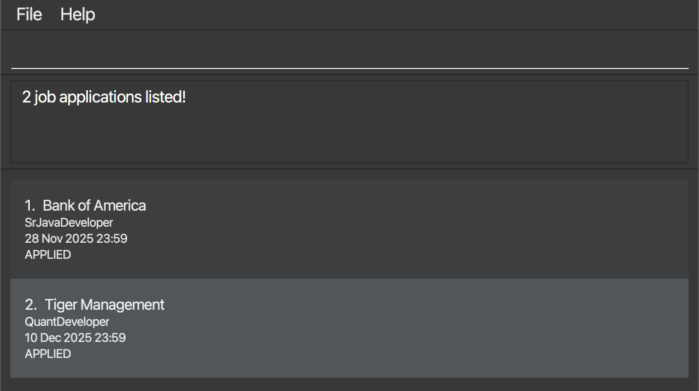
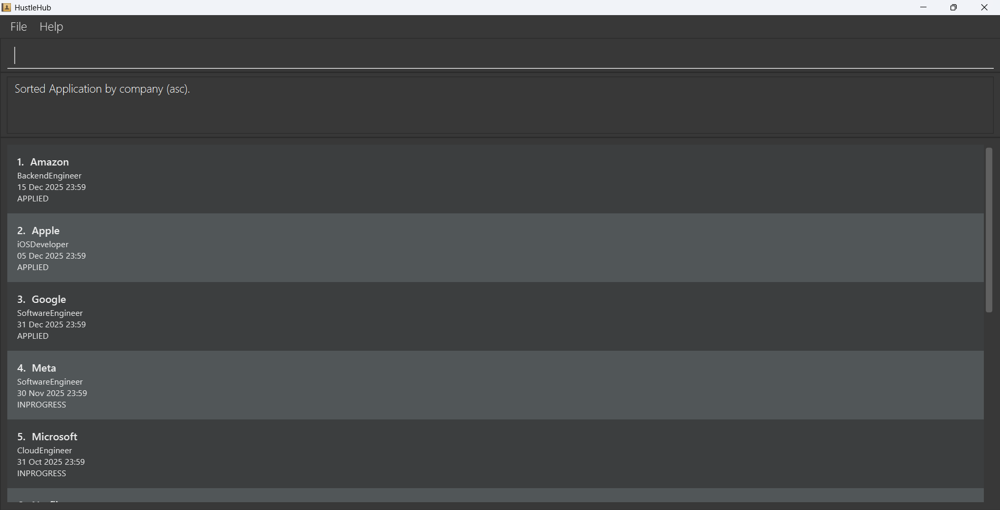
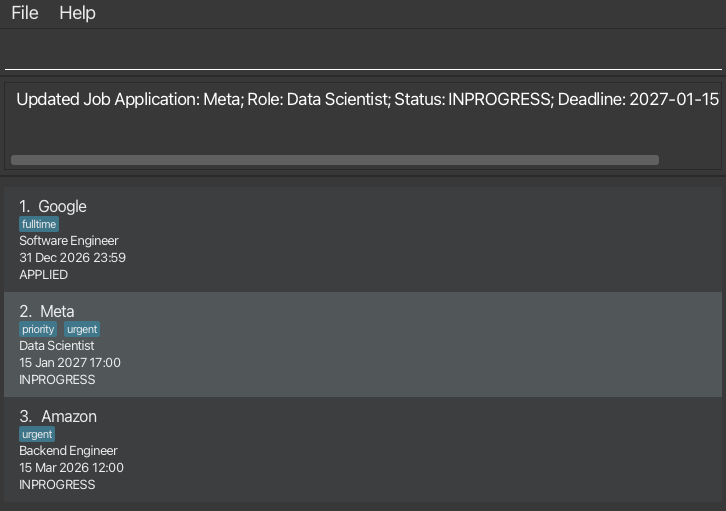
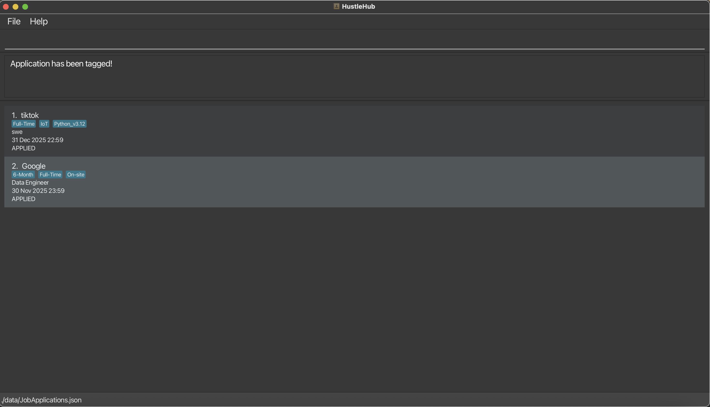
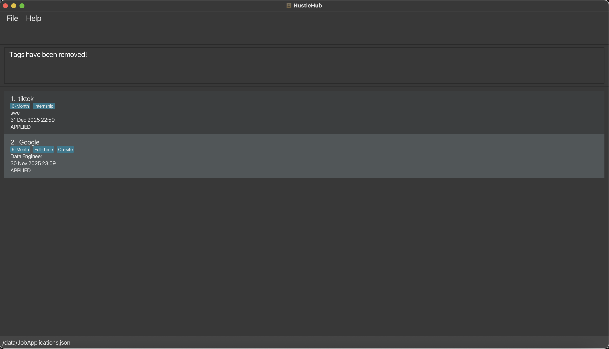

## Who Should Use HustleHub?

**Ideal for:**
- Computing students applying to 15+ positions simultaneously
- Users comfortable with command-line interfaces (CLI)
- Those who prefer keyboard-driven workflows over mouse clicking
- Anyone tracking applications with multiple status changes and deadlines

**Not ideal for:**
- Managing fewer than 5 applications (spreadsheet is simpler)
- Users unfamiliar with CLI syntax
- Teams needing collaborative features
- Users requiring visual calendar integrations

**Why HustleHub over alternatives?**
HustleHub combines CLI speed with visual overview, letting you update 5 applications in under 30 seconds - much faster than spreadsheets or web apps for heavy users.

---

* Table of Contents
{:toc}

--------------------------------------------------------------------------------------------------------------------

## Quick start

1. Ensure you have Java `17` or above installed in your Computer.<br>
   **Mac users:** Ensure you have Java `17` JDK version prescribed [here](https://se-education.org/guides/tutorials/javaInstallationMac.html).

1. Download the latest `.jar` file from this repository's [Releases](https://github.com/AY2526S1-CS2103T-T11-1/tp/releases) page.

1. Copy the file to the folder you want to use as the _home folder_ for HustleHub.

1. Open a command terminal, `cd` into the folder you put the jar file in, and run `java -jar <downloaded-jar-name>.jar` to start the application.<br>
   A GUI similar to the below should appear in a few seconds. Note that the app does not contain sample data.<br>
   

1. Type the command in the command box and press Enter to execute it. e.g. typing **`help`** and pressing Enter will open the help window.<br>
   Some example commands you can try:

   * `list` : Lists all applications.

   * `add n/Microsoft r/Cloud engineer s/INPROGRESS d/2025-10-31T23:59` : Adds an application for `Microsoft` to HustleHub.

   * `delete 3` : Deletes the 3rd application shown in the current list.

   * `update 1 s/INPROGRESS d/2027-01-15T17:00` : Updates the 1st application's status and deadline.

   * `sort deadline` : Sorts the applications by **deadline** (ascending by default). You can also sort by `company` or `role`, and use `desc`. e.g. `sort company desc`

   * `exit` : Exits the app.

1. Refer to the [Features](#features) below for details of each command and formatting datetime values.

--------------------------------------------------------------------------------------------------------------------

## Supported Languages

**Currently, HustleHub only supports the English language.** All commands, statuses, tags, and interactions should be conducted in English.

**Important:** 
- The **CLI** commands, such as `add`, `update`, `delete`, `sort`, and `filter`, as well as all statuses (e.g., `APPLIED`, `INPROGRESS`, `REJECTED`), and tags (e.g., `t/urgent`, `t/remote`) must be entered in **English**.
- Commands are **case-sensitive**, and they must be spelled in English.

--------------------------------------------------------------------------------------------------------------------

## Understanding HustleHub

Before diving into commands, let's understand the core concepts of HustleHub.

### Application Structure

Every job application in HustleHub contains the following information:

```
┌─────────────────────────────────────────────────────┐
│           Job Application Entry                     │
├─────────────────────────────────────────────────────┤
│ Company Name: Microsoft              [Required]     │
│ Role: Cloud Engineer                 [Required]     │
│ Status: INPROGRESS                   [Required]     │
│ Deadline: 31 Oct (23:59)             [Optional*]    │
│ Tags: remote, urgent, priority       [Optional]     │
│      (maximum 3 tags)                               │
└─────────────────────────────────────────────────────┘
```

**Key Points:**
- **Company**, **Role**, and **Status** are **required** when adding an application
- **Deadline** is **optional** - if omitted, defaults to today at 23:59
- **Company + Role** combination must be unique (no duplicates)
- **Tags** are optional and limited to 3 per application (max 30 characters each)
- **Deadline** must be a future date (supports multiple flexible formats)

### Status Lifecycle

Applications progress through three distinct stages:

```
   APPLIED ────────→ INPROGRESS ────────→ REJECTED
   (Submitted)       (Active Process)      (Closed)
      │                    │                   │
      │                    │                   │
   After you          During interviews,    After receiving
   click "Apply"      assessments, or       rejection
                      waiting for response
```

**Important Notes:**
- Status changes are **manual** - update them as your application progresses
- These are the ONLY valid values; custom statuses are not supported
- Status values are **case-insensitive** in commands: `applied` = `APPLIED`
- Use **tags** for more detailed tracking (e.g., `t/phone-screen`, `t/final-round`)
- Applications remain in your records even after rejection for future reference

### Filter vs. Find vs. Sort

Understanding the difference between these three operations:

```
┌─────────────────────────────────────────────────────────────┐
│ FILTER: Narrow down by exact property match                 │
│ ----------------------------------------------------------- │
│ [10 apps] ──filter s/APPLIED──> [3 apps with APPLIED]       │
│                                                             │
│ • Hides non-matching applications                           │
│ • Searches one field at a time (status, company, etc.)      │
│ • Exact match for status/deadline, partial for text         │
└─────────────────────────────────────────────────────────────┘

┌─────────────────────────────────────────────────────────────┐
│ FIND: Search across company name AND role                   │
│ ----------------------------------------------------------- │
│ [10 apps] ──find Google engineer──> [4 matching apps]       │
│                                                             │
│ • Hides non-matching applications                           │
│ • Searches BOTH company name and role simultaneously        │
│ • Partial keyword matching (case-insensitive)               │
└─────────────────────────────────────────────────────────────┘

┌─────────────────────────────────────────────────────────────┐
│ SORT: Reorder applications (no hiding)                      │
│ ----------------------------------------------------------- │
│ [A, Z, M, B] ──sort company──> [A, B, M, Z]                 │
│                                                             │
│ • Shows ALL applications, just reordered                    │
│ • Available fields: company, role, deadline                 │
│ • Ascending (asc) or descending (desc)                      │
└─────────────────────────────────────────────────────────────┘
```

**Quick Decision Guide:**

| I want to... | Use this command | Example |
|-------------|------------------|---------|
| See only applications with a specific status | `filter` | `filter s/APPLIED` |
| See only applications due on a date | `filter` | `filter d/2025-12-31` |
| Search for a company or role name | `find` | `find Google` or `find engineer` |
| Organize by deadline or alphabetically | `sort` | `sort deadline` or `sort company` |
| Reset and see everything | `filter none` or `list` | `filter none` or `list`|

--------------------------------------------------------------------------------------------------------------------

## Common Workflows

Now that you understand the core concepts, here are practical scenarios showing how to combine commands effectively.

#### Scenario 1: Weekly Deadline Check
**Goal:** Review upcoming deadlines and prioritize urgent applications

1. `sort deadline` — See applications by earliest deadline
2. Review the top 5 results to identify time-sensitive applications
3. `tag 1 t/urgent` — Mark the most urgent application
4. `tag 2 t/urgent` — Mark the second urgent application
5. `filter t/urgent` — Focus view on only urgent applications

**Why this works:** Sorting by deadline surfaces what needs attention first, tagging creates a reusable category, and filtering lets you focus exclusively on what matters this week.

### Scenario 2: After Receiving Interview Invitation
**Goal:** Update application status and add preparation notes

1. `find Stripe` — Quickly locate the company (avoid scrolling through full list)
2. Note the index shown (e.g., application appears as #3)
3. `update 3 s/INPROGRESS` — Change status from APPLIED to INPROGRESS
4. `tag 3 t/system-design t/behavioral-prep` — Add interview preparation tags

**Why this works:** `find` is faster than manual searching, `update` changes the status in one command, and tags help you track what interview prep is needed.

### Scenario 3: End-of-Month Cleanup
**Goal:** Remove old rejected applications to keep your list focused

1. `filter s/REJECTED` — View only rejected applications
2. Review deadlines to identify outdated entries (e.g., rejections from 3+ months ago)
3. `delete 1` — Remove the first result
4. `delete 1` — Remove the next (which is now first after previous deletion)
5. `list` — Return to viewing all applications

**Why this works:** Filtering isolates what you want to clean up, repeated `delete 1` removes items efficiently as the list re-indexes, and `list` clears the filter to return to normal view.

### Scenario 4: Comparing Similar Roles
**Goal:** Find and compare backend engineer positions across companies

1. `find backend` — Search for applications with "backend" in company name or role
2. `sort deadline` — Order by application deadline (earliest first)
3. Review side-by-side: company names, deadlines, and existing tags
4. `tag 2 t/top-choice` — Mark your preferred option among the results
5. `tag 5 t/backup` — Tag a safe backup option

**Why this works:** `find` searches both company and role fields to locate backend positions, deadline sorting shows urgency, and tags help you categorize your preferences within the search results.

### Scenario 5: Preparing for Career Fair
**Goal:** Add multiple new applications quickly after a career fair

1. `add n/Meta r/Software Engineer s/APPLIED d/15 Nov` — Add first company (short date format!)
2. `add n/Netflix r/Backend Engineer s/APPLIED d/20 Nov t/career-fair` — Add second with tag
3. `add n/Salesforce r/Cloud Engineer s/APPLIED d/18 Nov t/career-fair` — Add third
4. `filter t/career-fair` — View all applications from this event
5. `sort deadline` — Prioritize by earliest deadline

**Why this works:** Using flexible date formats (like `15 Nov`) makes data entry much faster during busy career fairs. Batch adding with a consistent tag (`t/career-fair`) lets you track applications from the same source, filtering by that tag groups them together, and sorting helps you tackle applications strategically.

### Scenario 6: Following Up on Pending Applications
**Goal:** Identify applications with no response for 2+ weeks

1. `filter s/APPLIED` — Show applications still in "applied" status
2. `sort deadline asc` — Order by deadline (earliest first)
3. Review companies where deadline is approaching but status hasn't changed
4. `tag 3 t/follow-up` — Mark applications that need a status check email
5. `filter t/follow-up` — Focus on applications requiring action

**Why this works:** Status filtering finds stagnant applications, deadline sorting reveals time pressure, tags create an actionable todo list, and re-filtering keeps you focused on follow-up tasks.

### Scenario 7: Filtering and Deleting Rejected Applications
**Goal:** Clean up rejected applications while understanding how deletion works with filtered views

**The Situation:** You have 10 total applications. Several were rejected, and you want to remove them to keep your list focused.

**Important:** ⚠️ Index numbers change when you filter - they always reflect what's currently visible!

**Step-by-step:**

1. `filter s/REJECTED` — Shows only rejected applications (let's say 4 results appear)
2. Review the filtered list - applications are now numbered 1, 2, 3, 4 in the display
3. `delete 1` — Deletes the **first application in the filtered view**
4. The list updates - remaining rejections are now numbered 1, 2, 3
5. `delete 1` — Deletes what is now the first visible application
6. `list` — Returns to full view (now shows 8 total applications)

**Why this matters:**
- **Index numbers always reflect your CURRENT view**, not the original full list
- After filtering, indices restart from 1 for visible results only
- `delete 1` always deletes the **first VISIBLE application**, regardless of its original position
- Same principle applies to `update`, `tag`, and `untag` commands

**Visual Example:**
```
Full list (10 apps):          After filter s/REJECTED:     After delete 1:
1. Google | APPLIED           1. Meta | REJECTED           1. Apple | REJECTED
2. Meta | REJECTED            2. Apple | REJECTED          2. Netflix | REJECTED
3. Amazon | APPLIED           3. Netflix | REJECTED        3. Stripe | REJECTED
4. Apple | REJECTED           4. Stripe | REJECTED         
5. Tesla | INPROGRESS         (only 4 visible)             (only 3 visible)
6. Netflix | REJECTED
7. Uber | APPLIED
8. Stripe | REJECTED
9. Airbnb | INPROGRESS
10. Lyft | APPLIED
```

**Key Takeaway:** When working with filtered views, always use the index numbers you see in the current display. If unsure, run `list` first to see the unfiltered view.

--------------------------------------------------------------------------------------------------------------------

## Command summary

### General Commands

| Command                                      | Description                                  | Format |
|----------------------------------------------|----------------------------------------------|--------|
| [**exit**](#exiting-the-program--exit)       | Exits the program                            | `exit` |
| [**help**](#viewing-help--help)              | Displays a link to the user guide | `help` |
| [**list**](#listing-all-applications--list)  | Lists all applications                       | `list` |

### Application Management

| Command                                          | Description                                      | Format                                                                     |
|--------------------------------------------------|--------------------------------------------------|----------------------------------------------------------------------------|
| [**add**](#adding-a-job-application-add)         | Adds a job application to HustleHub              | `add n/COMPANY_NAME r/ROLE s/STATUS [d/DEADLINE] [t/TAG]…​`                |
| [**delete**](#deleting-an-application--delete)   | Deletes a job application given its index number | `delete INDEX`                                                             |
| [**find**](#finding-job-applications-find)       | Finds job applications by company name or role   | `find KEYWORD [MORE_KEYWORDS]`                                             |
| [**filter**](#filtering-job-applications-filter) | Filters job applications by a property           | `filter FLAG/KEYWORD`                                                      |
| [**sort**](#sorting-the-applications--sort)      | Sorts the job applications in HustleHub          | `sort FIELD`                                                               |
| [**update**](#updating-a-job-application-update) | Updates an existing job application's details    | `update INDEX [n/COMPANY_NAME] [r/ROLE] [s/STATUS] [d/DEADLINE] [t/TAG]…​` |

### Tag Management

| Command                           | Description                                   | Format                                  |
|-----------------------------------|-----------------------------------------------|-----------------------------------------|
| [**tag**](#adding-tags-tag)       | Adds new tags to a specified job application  | `tag JOB_APPLICATION_INDEX t/NEW_TAG`   |
| [**untag**](#removing-tags-untag) | Removes tags from a specified job application | `untag JOB_APPLICATION_INDEX t/NEW_TAG` |

--------------------------------------------------------------------------------------------------------------------

## Features

<div markdown="block" class="alert alert-info">

**:information_source: Notes about the command format:**<br>

* Words in `UPPER_CASE` are the parameters to be supplied by the user.<br>
  e.g. in `add n/COMPANY_NAME`, `COMPANY_NAME` is a parameter which can be used as `add n/Google r/Software Engineer s/APPLIED d/2025-12-31T23:59`.

* Items in square brackets are optional.<br>
  e.g. `n/COMPANY_NAME [t/TAG]` can be used as `n/Google t/priority` or as `n/Google`.

* Items with `…`​ after them can be used multiple times including zero times.<br>
  e.g. `[t/TAG]…​` can be used as ` ` (i.e. 0 times), `t/urgent`, `t/urgent t/remote` etc.

* Parameters can be in any order.<br>
  e.g. if the command specifies `n/COMPANY_NAME r/ROLE`, `r/ROLE n/COMPANY_NAME` is also acceptable.

* Extraneous parameters for commands that do not take in parameters (such as `help`, `list`, `exit`) will be ignored.<br>
  e.g. if the command specifies `help 123`, it will be interpreted as `help`.

* If you are using a PDF version of this document, be careful when copying and pasting commands that span multiple lines as space characters surrounding line-breaks may be omitted when copied over to the application.

</div>

--------------------------------------------------------------------------------------------------------------------

## General Commands

### Exiting the program : `exit`

Exits the program.

Format: `exit`

<br>

[<u>Back to Command Summary</u>](#command-summary)

### Viewing help : `help`

Shows a message explaining how to access the help page.

Format: `help`


<br>

[<u>Back to Command Summary</u>](#command-summary)

### Listing all applications : `list`

Lists all job applications in HustleHub. This is useful after filtering to return to viewing all applications.

Format: `list`

<div markdown="span" class="alert alert-primary">:bulb: **Tip:**
`list` and `filter none` have the same effect - both show all applications.
</div>


<br>


[<u>Back to Command Summary</u>](#command-summary)

### Saving data

HustleHub data is automatically saved after any command that changes the data. There is no need to save manually.

### Editing the data file

HustleHub data is saved automatically as a JSON file `[JAR file location]/data/JobApplications.json`. Advanced users are welcome to update data directly by editing that data file.

<div markdown="span" class="alert alert-warning">:exclamation: **Caution:**
If your changes to the data file make its format invalid, HustleHub will discard all data and start with an empty data file at the next run. Hence, it is recommended to take a backup of the file before editing it. Furthermore, certain edits can cause HustleHub to behave in unexpected ways (e.g., if a value entered is outside of the acceptable range). Therefore, edit the data file only if you are confident that you can update it correctly.
</div>

---

## Application Management

### Adding a job application: `add`

Adds a job application to HustleHub.

Format: `add n/COMPANY_NAME r/ROLE s/STATUS [d/DEADLINE] [t/TAG]…​`

#### **Rules**
1. No job applications can have the same combination of role and company name.
2. An application can have up to 3 tags.
3. Deadline cannot be in the past. Please provide a future date (supports flexible formats - see Date & Time Formats section).

<div markdown="block" class="alert alert-info">
:bulb: **Tips:** <br>

* The deadline (`d/`) is **optional**. If omitted, it defaults to today at 23:59.

* You can use **flexible date formats** for the deadline - see the Date & Time Formats section above for all supported formats.

* New applications appear at the **top** of your list for easy visibility.

</div>

#### **Examples**
* `add n/Google r/Software Engineer s/APPLIED` - No deadline specified, defaults to today
* `add n/Microsoft r/Cloud Engineer s/INPROGRESS d/31 Oct` - Short date format
* `add n/Amazon r/Data Scientist s/APPLIED d/12-25` - Month-day format
* `add n/Meta r/Frontend Developer s/APPLIED d/2025-11-30T14:00` - Full date-time format
* `add n/Netflix r/Backend Engineer s/APPLIED d/15 December t/remote t/urgent` - With tags


<br>


[<u>Back to Command Summary</u>](#command-summary)

### Deleting an application : `delete`

Deletes the specified application from HustleHub.

Format: `delete INDEX`

#### **Rules**
1. Deletes the application at the specified `INDEX`.
2. The index refers to the index number shown in the displayed application list.
3. The index **must be a positive number** 1, 2, 3, …​

#### **Examples**
* `list` followed by `delete 2` deletes the 2nd application in HustleHub.
* After filtering the list, `delete 1` deletes the 1st application in the currently displayed results.

<br>

[<u>Back to Command Summary</u>](#command-summary)

### Finding job applications: `find`

Finds job applications whose **Company Name** or **Role** matches any of the given keywords.

Format: `find KEYWORD [MORE_KEYWORDS]`

#### **Rules**

1. Searches using only **Company Name** and **Role**, Returning applications containing at least one keyword.
2. The search is case-insensitive.
3. Keywords allows partial matching.

#### **Examples**

* `find morgan` - Finds job applications containing `morgan` in company name or role.
* `find engineer` - Returns applications with roles like "Software Engineer", "Data Engineer".
* `find Tiger Analyst` - Returns company names such as `Tiger Management`, and/or any role containing `Analyst`.

`find engineer backend` returns all applications where company OR role contains either "backend" OR "engineer"



<br>

[<u>Back to Command Summary</u>](#command-summary)

### Filtering Job Applications: `filter`

Filters the list of job applications based on a single field: **Tags**, **Status**, or **Application Deadline**.

Format: `filter FLAG/KEYWORD` or, to remove all filters: `filter none`

#### **Rules**

1. Does **case-insensitive matches** with the `KEYWORD` is **contained** in any tag - (`t/`)
2. Matches an exact, **case-insensitive** application status - (`s/`)
3. Matches the exact date only, ignoring the time component - (`d/`)
    * The date must be in the **`yyyy-MM-dd`** format (e.g., `2025-12-31`).
    * Matches all applications due on that date regardless of time
4. Filter command accepts only one filter flag at a time.

#### **Examples**
* `filter t/backend` - Returns applications with tags containing "backend" (e.g., "backend", "backend-dev").
* `filter s/applied` - Returns applications with the status "APPLIED".
* `filter d/2025-10-20` - Returns applications with an application deadline on October 20, 2025.
* `filter none` - Removes all current filters and shows the complete list of job applications.


<br>

[<u>Back to Command Summary</u>](#command-summary)

### Sorting the applications : `sort`

Sorts the current list of applications by a chosen field, in ascending or descending order.

**Format:** `sort FIELD [ORDER]`
- **FIELD**: `company` \| `role` \| `deadline`
- **ORDER** (optional): `asc` \| `ascending` \| `desc` \| `descending` (default: `asc`)

#### **Rules**
1. Sorting is **stable** and **case-insensitive** for text fields (`company`, `role`).
2. When sorting by **deadline**, missing/invalid deadlines appear **last** for `asc` (and **first** for `desc`).

#### **Examples**
- `sort deadline` - Sorts existing applications by deadline by the default order, ascending.
- `sort company desc` - Sorts existing applications by company names in descending order
- `sort role ascending` - Sorts existing applications by role names in ascending order



<br>

[<u>Back to Command Summary</u>](#command-summary)

### Updating a job application: `update`

Updates the details of an existing job application in HustleHub.

Format: `update INDEX [n/COMPANY_NAME] [r/ROLE] [s/STATUS] [d/DEADLINE] [t/TAG]…​`

#### **Rules**
1. Updates the job application at the specified `INDEX`.
2. The index refers to the index number shown in the displayed application list.
3. The index **must be a positive number** 1, 2, 3, …​.
4. At least one of the optional fields must be provided.
5. Existing values will be overwritten by the input values.
6. When updating tags with `t/TAG`, all existing tags will be replaced by the new tags specified.
7. Deadline cannot be in the past.

<br>

<div markdown="span" class="alert alert-primary">:bulb: **Tip:**
You can remove all tags by typing `t/` without specifying any tags after it.
</div>

#### **Examples**
* `update 1 s/INPROGRESS` - Updates the status of the 1st application to INPROGRESS.
* `update 2 r/Senior Engineer d/15 Jan` - Updates the role and deadline using short date format.
* `update 3 n/Apple r/iOS Developer s/APPLIED d/30 June t/remote t/urgent` - Updates all fields with flexible date.
* `update 4 d/2027-01-15T14:00` - Updates deadline with specific time.
* `update 1 t/` - Removes all tags from the 1st application.




<br>

[<u>Back to Command Summary</u>](#command-summary)

--------------------------------------------------------------------------------------------------------------------

## Tag Management

### Adding tags: `tag`

Adds tags to a job application.

Format: `tag JOB_APPLICATION_INDEX t/TAG...`

#### **Rules**
1. A `TAG` must be 1 to 30 characters long (cannot be blank).
2. A `TAG` is a single word (no spaces).
3. Each job application can have up to 3 tags.
4. Adding of tags is **case-insensitive**
5. Allowed characters: 
   - **Letters** (a-z, A-Z)
   - **Digits** (0-9)
   - **Special characters** (at most 2 total from this list):
     - Hyphen (`-`)
     - Period (`.`)
     - At sign (`@`)
     - Hash/Pound (`#`)
     - Underscore (`_`)
     - Plus (`+`)

<div markdown="span" class="alert alert-primary">:bulb: **Tip:**
If you add a mix of duplicate and new tags, the new tags will be added whilst duplicates will be ignored.
</div>

#### **Examples**
- `tag 5 t/backup t/safe-option` - Tags the 5th application with 2 tags containing the values: `backup`, and `safe-option`
- `tag 2 t/remote` - Tags the 2nd application with 1 tag containing the value: `remote`
- `tag 3 t/leetcode-heavy t/system-design` - Tag the 3rd application containing the values: `leetcode-heavy` and `system-design`
- `tag 6 t/Java t/java` - Tag the 6th application with the 1st tag from the left: `Java`, and ignores the next tag `java` as both are the same tag.




<br>

[<u>Back to Command Summary</u>](#command-summary)

### Removing tags: `untag`

Removes tags from a job application.

Format: `untag JOB_APPLICATION_INDEX t/TAG...`

#### **Rules**
1. A `TAG` must be 1 to 30 characters long (cannot be blank).
2. A `TAG` is a single word (no spaces).
3. Adding of tags is **case-insensitive**
4. Allowed characters:
    - **Letters** (a-z, A-Z)
    - **Digits** (0-9)
    - **Special characters** (at most 2 total from this list):
        - Hyphen (`-`)
        - Period (`.`)
        - At sign (`@`)
        - Hash/Pound (`#`)
        - Underscore (`_`)
        - Plus (`+`)
5. Inputted tags must already exist on the application.

#### **Examples**
- `untag 1 t/SQL` - Removes a tag with the value `SQL` from the 1st job application
- `untag 2 t/6-Month t/C++` - Removes 2 tags with the values `6-Month` and `C++` from the 2nd job application
- `untag 3 t/python_v3.12 t/BlockChain t/Full-Stack` - Removes 3 tags with the values `python_v3.12`, `BlockChain`, and `Full-Stack` from the 3rd job application.



<br>

[<u>Back to Command Summary</u>](#command-summary)

---

## Troubleshooting Common Errors

This section helps you resolve common errors you might encounter while using HustleHub.

### Command Format Errors

#### "Invalid command format!"
**Cause:** Missing required parameters or incorrect syntax.

**Solutions:**
- Ensure all required fields are provided with their prefixes (n/, r/, s/, d/)
- Check for typos in command names
- Verify prefixes are correct (use n/ not name/)
- Don't put text before the first prefix

**Examples:**
```
❌ add Microsoft Cloud Engineer APPLIED 2025-12-31T23:59
❌ add name/Microsoft role/Cloud Engineer
✅ add n/Microsoft r/Cloud Engineer s/APPLIED d/2025-12-31T23:59
```

---

### Date & Time Errors

#### "Invalid deadline format"
**Error Message:** `Invalid deadline format. Expected format: yyyy-MM-ddTHH:mm`

**Cause:** Incorrect date format or missing time component.

**Solutions:**
- Use format: `yyyy-MM-ddTHH:mm` (year-month-dayThour:minute)
- Use 24-hour format (17:00, not 5:00 PM)
- Include minutes even if :00

**Examples:**
```
❌ add n/Google r/SWE s/APPLIED d/2025-12-31
   (missing time - must include T and time)

❌ add n/Google r/SWE s/APPLIED d/31-12-2025T23:59
   (wrong date order - must be year first)

❌ add n/Google r/SWE s/APPLIED d/2025/12/31T23:59
   (wrong separators - use hyphens not slashes)

❌ add n/Google r/SWE s/APPLIED d/2025-12-31 23:59
   (missing T separator)

✅ add n/Google r/SWE s/APPLIED d/2025-12-31T23:59
✅ update 1 d/2026-01-15T09:00
```

<div markdown="block" class="alert alert-info">

:bulb: **Tip:**

**Date & Time Formats**

HustleHub now supports **flexible date formats** to make adding applications faster and easier!

*When adding/updating applications, you can use any of these formats:*

**Full Date-Time Formats** (if you need a specific time):
- `yyyy-MM-ddTHH:mm` → `2025-12-31T23:59`
- `yyyy-MM-dd HH:mm` → `2025-12-31 23:59`

**Date-Only Formats** (defaults to 23:59):
- `yyyy-MM-dd` → `2025-12-31` (defaults to 23:59)
- `MM-dd` → `12-31` (infers current or next year, defaults to 23:59)
- `dd MMM` → `31 Dec` (infers year, defaults to 23:59)
- `dd MMMM` → `31 December` (infers year, defaults to 23:59)
- `dd-MMM` → `31-Dec` (infers year, defaults to 23:59)

**No Deadline Specified**:
- Simply omit the `d/` flag entirely, and the deadline defaults to **today at 23:59**

*When filtering by deadline:*
- Format: `yyyy-MM-dd` (time not needed)
- Example: `2025-12-31`
- Matches all applications due on that date regardless of time

*Smart Year Inference:*
- When you use formats like `12-31` or `31 Dec` without specifying the year:
    - If the date would be in the past, HustleHub automatically uses **next year**
    - Otherwise, it uses the **current year**

*Rules:*
- Must be a future date (no past deadlines)
- Time component uses 24-hour format when specified

</div>

---

### Tag Errors

#### "Cannot add tags: This application would exceed 3 tags"
**Cause:** Trying to add tags when the application already has 3 tags (the maximum allowed).

**Solutions:**
1. Remove existing tags first using `untag`
2. Then add new tags using `tag`
3. Or use `update` to replace all tags at once

**Examples:**
```
# Application already has 3 tags: urgent, remote, priority

❌ tag 1 t/high-pay
   (would make 4 tags total)

✅ untag 1 t/remote
   (removes one tag first)
   
✅ tag 1 t/high-pay
   (now you can add - total is 3)

# Alternative: Replace all tags at once
✅ update 1 t/urgent t/priority t/high-pay
   (replaces all existing tags)
```

#### "Tags must be a single word (no spaces)"
**Error Message:** `Tags must be a single word (no spaces) with up to 30 characters. Allowed: letters, numbers, and at most 2 special characters from: - . @ # _ +`

**Cause:** Tag contains spaces, is too long, or has too many special characters.

**Solutions:**
- Use hyphens (-) or underscores (_) instead of spaces
- Keep tags under 30 characters
- Use at most 2 special characters from: - . @ # _ +
- Single word only (no spaces allowed)

**Examples:**
```
❌ tag 1 t/high priority
   (contains space - use hyphen instead)

❌ tag 1 t/C+++++
   (too many special characters - max 2 allowed)

❌ tag 1 t/very-long-tag-name-that-exceeds-thirty-characters-limit
   (exceeds 30 character limit)

❌ tag 1 t/my tag
   (contains space)

✅ tag 1 t/high-priority
✅ tag 1 t/C++
✅ tag 1 t/python_v3.12
✅ tag 1 t/6-Month
✅ tag 1 t/Full-Stack
✅ tag 1 t/remote-work
```

#### "Cannot remove tags: One or more of the specified tags do not exist"
**Cause:** Trying to remove tags that aren't currently on the application.

**Solutions:**
- Check existing tags by viewing the application in the UI
- Verify exact spelling (tags are case-sensitive)
- Use `list` to see all applications with their current tags

**Examples:**
```
# Application currently has tags: backend, java

❌ untag 1 t/Backend
   (wrong case - tag is 'backend' not 'Backend')

❌ untag 1 t/python
   (tag doesn't exist on this application)

❌ untag 1 t/back-end
   (wrong format - tag is 'backend' not 'back-end')

✅ untag 1 t/backend t/java
   (exact matches - both tags exist)

✅ untag 1 t/backend
   (removes just one tag)
```

---

### Index Errors

#### "The application index provided is invalid"
**Cause:** Index doesn't exist in the current displayed list or has invalid format.

**Solutions:**
- Check the displayed list (numbers shown on the left side of each card)
- Use only positive numbers (1, 2, 3...)
- After filtering/finding, indices are renumbered - use the currently displayed numbers
- Run `list` to see all applications and their current indices

**Examples:**
```
❌ delete 0
   (index must be positive - starts from 1)

❌ delete -1
   (negative numbers not allowed)

❌ delete abc
   (must be a number, not letters)

❌ delete 99
   (if only 5 applications exist in current view)

✅ delete 1
   (deletes first application in current list)

✅ find Google
✅ delete 1
   (deletes first result from search, not first in full list)
```

---

### Filter & Find Errors

#### "Invalid date format" (when filtering)
**Important:** Filter uses a DIFFERENT date format than add/update!

**Format for add/update:** `yyyy-MM-ddTHH:mm` (includes time)  
**Format for filter:** `yyyy-MM-dd` (date only, NO time)

**Examples:**
```
❌ filter d/2025-12-31T23:59
   (don't include time when filtering)

❌ filter d/31-12-2025
   (wrong date order)

✅ filter d/2025-12-31
   (date only - correct format for filtering)

✅ add n/Google r/SWE s/APPLIED d/2025-12-31T23:59
   (add/update commands need time)
```

#### Can't find applications after filtering/finding?
**Cause:** Filter and find commands HIDE applications that don't match.

**Solutions:**
- Run `list` to show all applications again
- Or run `filter none` (same effect as list)
- Remember: Your applications aren't deleted, just hidden from view

**Examples:**
```
# You filtered by status and now can't see other applications

✅ list
   (shows all applications again)

✅ filter none
   (also shows all applications)

# After finding "Google", you want to see everything

✅ list
   (returns to full list)
```

---

### General Tips

#### Commands not working?
**Checklist:**
1. Check for extra spaces before or after commands
2. Verify all prefixes are correct (n/, r/, s/, d/, t/)
3. Ensure required prefixes are present
4. Parameters can be in any order, but all prefixes are required
5. Try the example commands from this guide exactly as shown

#### Need to start over?
If your data gets corrupted:
1. Close HustleHub
2. Delete `[JAR file location]/data/JobApplications.json`
3. Restart HustleHub - it will start with an empty data file

#### Still stuck?
1. Check the command format in the [Features](#features) section
2. Review the [Common Workflows](#common-workflows) for practical examples
3. Try the exact example commands provided in this guide
4. Verify your Java version is 17 or above

---

## FAQ

**Q**: How do I transfer my data to another computer?<br>
**A**: Install the app on the other computer and overwrite the empty data file it creates with the file that contains the data of your previous HustleHub home folder.

--------------------------------------------------------------------------------------------------------------------

## Known issues

1. **When using multiple screens**, if you move the application to a secondary screen, and later switch to using only the primary screen, the GUI will open off-screen. The remedy is to delete the `preferences.json` file created by the application before running the application again.
2. **If you minimize the Help Window** and then run the `help` command (or use the `Help` menu, or the keyboard shortcut `F1`) again, the original Help Window will remain minimized, and no new Help Window will appear. The remedy is to manually restore the minimized Help Window.
